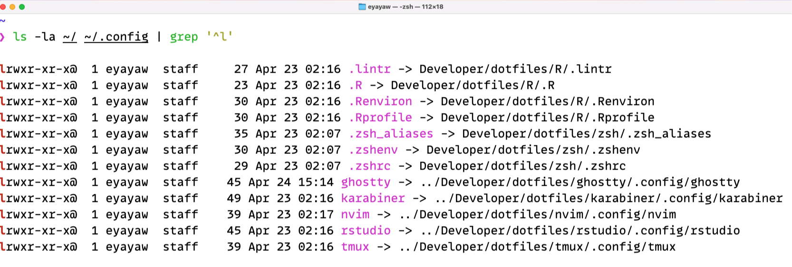

I finally treated myself to a new Mac Mini for completing my PhD. In the past, setting up a new machine meant hours of manual downloading, clicking through installers, and tediously configuring apps and tweaking default OS settings. However, over time I learned setup automation, so now I can get everything up and running quickly with minimal manual effort.

What have I learned? Writing a set of shell scripts that handle everything from app installation to config, and setting default settings. This post walks through my approach to programmatically setting up a new Mac and the tools that make it possible.


::: {layout-ncol="2"}


:::


## TL;DR

**Apps and CLI tools**: I use [Homebrew](https://github.com/Homebrew/brew) as my package manager to install everything from `1Password` and `Raycast` to dev tools like `Python`, `R`, and `DuckDB`. For Mac App Store apps, I use [`mas`](https://github.com/mas-cli/mas).

**Configs**: I manage my configs with [GNU Stow](https://www.gnu.org/software/stow/), which creates symlinks from my version-controlled [`dotfiles`](https://github.com/eyayaw/dotfiles) to the proper locations in my `${HOME}` directory.

**macOS defaults**: I apply custom macOS settings through a script that changes some default options (like enabling list view in Finder and disabling "natural" scrolling).

## The automation process

Package managers are the key to automation. I remember the days when I used to spend hours manually downloading and installing apps until I discovered tools like [`apt`](https://manpages.ubuntu.com/manpages/xenial/man8/apt.8.html) for Ubuntu and [`Homebrew`](https://brew.sh) for macOS. Another milestone was when I discovered about [dotfiles](https://wiki.archlinux.org/title/Dotfiles), configs that you can version-control and use across machines.^[Scripts for application installation and changing default OS options are also part of dotfiles. See examples [here](https://dotfiles.github.io/inspiration/).]

By combining package management with dotfiles, and macOS default settings, I created a system that helps me set up a new machine with all my favorite tools and configs in a fraction of the time it used to take me. There are three main components of this system:
(1) package management with Homebrew, (2) GNU Stow-ed dotfiles, and (3) customizing macOS defaults.

## Component 1: Package Management with Homebrew

macOS, unlike many Linux distros, doesn't come with a built-in package manager. [Homebrew](https://docs.brew.sh/) fills this ("the missing package manager") gap, becoming the first tool I install on any new Mac:

```sh
/bin/bash -c "$(curl -fsSL https://raw.githubusercontent.com/Homebrew/install/master/install.sh)"
```

Homebrew lets me install both GUIs (casks) and cli tools (formulae) and through simple commands. Here is how I install my favorite packages via Homebrew:

### Core tools

```sh
# Password and secrets management
brew install --cask 1password
brew install 1password-cli

# Application launchers (with window management, clipboard history and other features)
brew install --cask raycast alfred

brew install --cask arc  # modern browser
brew install --cask karabiner-elements  # for keyboard customization

# Terminal environment
brew install --cask ghostty  # terminal emulator
brew install git # not to interfere with the system: macOS comes with a pre-installed version
brew install starship # shell prompts
brew install tmux  # terminal multiplexer
brew install stow  # for dotfiles management
```

### Command-line utilities

```sh
brew install tldr  # simplified man pages
# Better alternatives to standard tools
brew install fzf # a fuzzy finder
brew install bat ripgrep fd  # modern alts for cat, grep, find

# Additional CLI tools
brew install gh  # GitHub CLI
brew install mas  # for Mac App Store apps
```

### Dev environments

```sh
# Programming languages
brew install --cask r # the cask version is recommended, https://x.com/jimhester_/status/1374342249568481288
brew install python lua

# Package managers and code quality tools
brew install uv ruff  # Python package manager and linter
brew tap r-lib/rig && brew install --cask rig  # R version manager

# Editors and IDEs
brew install --cask visual-studio-code zed  # modern code editors
brew install --cask visual-studio-code@insiders zed@preview  # unstable versions
brew install --cask rstudio positron  # R & Python IDEs by Posit
brew install neovim  # for btw
```

I also install typefaces (mostly coding fonts). My [fonts installer script](https://github.com/eyayaw/dotfiles/blob/main/scripts/install/fonts.sh) copies my purchased fonts to `~/Library/Fonts/`, including [MonoLisa](https://monolisa.dev) and [Berkeley Mono](https://usgraphics.com/products/berkeley-mono). The free ones can be installed via Homebrew, such as [JetBrains Mono](https://github.com/JetBrains/JetBrainsMono) and [Monaspace](https://github.com/githubnext/monaspace).

```sh
# Fonts
brew install --cask font-{jetbrains-mono,monaspace,ibm-plex-mono}
brew install --cask font-{fontawesome,inter,open-sans,roboto}
```

I also install Mac App Store apps, mostly not free:

```sh
# Mac App Store apps (using mas)
mas install 441258766  # Magnet
mas install 424389933  # Final Cut Pro
mas install 1091189122  # Bear Notes
```

As an academic, I use [Zotero](https://zotero.org) for reference management (sometimes as read-later storage, and has an impressive PDF reader). For academic citations, I use [Better BibTex](https://retorque.re/zotero-better-bibtex) to automatically generate citations keys in Zotero.
I write a script to install this addon, instead of [manually installing](https://retorque.re/zotero-better-bibtex/installation/) it.

::: {.callout-tip collapse=false}
The [citation key formula](https://retorque.re/zotero-better-bibtex/citing/formulas/index.html) I use is `authEtal(sep='_').lower+year.prefix(_)`, which generates citation keys like `glaeser_2010`, `glaeser_gyourko_2009`, and `glaeser_etal_2020` for single, two, and three or more authors, respectively.

You can read [this](https://retorque.re/zotero-better-bibtex/citing/index.html#configurable-citekey-generator) on how to configure the citation key generator.
:::

Lastly, I wrote a script that installs [tpm](https://github.com/tmux-plugins/tpm), a plugin manager for [tmux](https://github.com/tmux/tmux), inspired by typecraft-dev's [crucible](https://github.com/typecraft-dev/crucible/blob/main/install-tpm.sh).


All of these installations are automated in a single script [`scripts/install/install.sh`](https://github.com/eyayaw/dotfiles/blob/main/scripts/install/install.sh), which sources the relevant scripts. If you're curious about in the full list of my favorite tools, see [here](/my-setup.qmd).

## Component 2: Configuration Management with Dotfiles

After installing apps, the next challenge is configuring them. This is where [dotfiles](https://wiki.archlinux.org/title/Dotfiles) come in, which are configs (often hidden, starting with a dot, hence the name) that control how apps behave.


Dotfiles are simply text-based configs. Examples include: `.zshrc` for Zsh config, `.gitconfig` for Git preferences, and various configs for editors, terminal emulators, and other tools.

By storing these files in a version-controlled repository, we can easily track changes and sync configs across machines.

### Managing dotfiles with GNU Stow

Managing my dotfiles was challenging, and I often lost them since they typically reside in the home directory, which I don't sync with iCloud Drive. (Of course, you can!) Then I discovered [GNU Stow](https://www.gnu.org/software/stow/), through Dreams of Autonomy's [video](https://www.youtube.com/watch?v=y6XCebnB9gs).

Stow creates symlinks from a repository (in my case located at `~/Developer/dotfiles/`) to the locations where apps expect to find their configs, usually in the home directory (i.e., `~`) and its subdirectories such as `.config`.

Here is how I structure my dotfiles repository:

```
~/Developer/dotfiles/
├── zsh/            # Shell configs
│   ├── .zshrc
│   ├── .zshenv
│   └── .zsh_aliases
├── zed/            # Zed editor settings
│   └── .config/
│       └── zed/
│           ├── settings.json
│           └── keymap.json
├── git/
│   └── .gitconfig
└── ... other tools
```

Notice how the directory structure (for each package) mirrors where these files would normally live in my home directory.This is key to how Stow works.

To apply these configs, I simply run:

```sh
# or run from anywhere by adding the `--dir` flag with the location of your dotfiles
# in my case `--dir=${HOME}/Developer/dotfiles`
cd ~/Developer/dotfiles
stow --target=${HOME} zsh ghostty karabiner git tmux zed R rstudio
```

{#screenshot-stow-in-action}


As shown in the screenshot above, Stow creates symbolic links from the appropriate locations in my home directory to the files in my dotfiles repository. When I update a config file in my dotfiles, the change is automatically reflected in the corresponding config file and hence the package that uses the config, and vice versa.

For example, here is a simplified version of my Zed config which is located at `~/Developer/dotfiles/zed/.config/zed/settings.json`:

```json
{
  "base_keymap": "VSCode",
  "vim_mode": true,
  "relative_line_numbers": true,
  "buffer_font_family": "MonoLisa",
  "buffer_font_size": 15,
  "ui_font_size": 15,
  "theme": {
    "mode": "system",
    "light": "Zed Legacy: Solarized Light",
    "dark": "One Dark"
  },
  "wrap_guides": [72, 80, 120],
  "soft_wrap": "editor_width"
}
```

With Stow, this file lives in my dotfiles repository but appears to Zed as if it's in the expected `~/.config/zed/` location.


## Component 3: Customizing macOS Defaults

macOS comes with many default settings that I immediately change on a new system. Rather than clicking through System Preferences, I use a [script](https://github.com/eyayaw/dot/blob/main/scripts/macos/set_defaults.sh) that modifies these settings programmatically, which are mostly adapted from Mathias Bynens' [dotfiles](https://github.com/mathiasbynens/dotfiles/blob/master/.macos).


```sh
# Use list view in Finder by default
defaults write com.apple.finder FXPreferredViewStyle -string "Nlsv"

# Disable "natural" scrolling (which feels unnatural to many)
defaults write NSGlobalDomain com.apple.swipescrolldirection -bool false

# Faster keyboard repeat rate
defaults write NSGlobalDomain KeyRepeat -int 1
defaults write NSGlobalDomain InitialKeyRepeat -int 10

# Show hidden files in Finder
defaults write com.apple.finder AppleShowAllFiles -bool true

# Disable automatic capitalization, smart quotes, etc.
defaults write NSGlobalDomain NSAutomaticCapitalizationEnabled -bool false
```

These commands modify the property list files that store macOS preferences. After running my settings script, I restart the machine to ensure all changes take effect.

## Putting it all together

My complete setup process is orchestrated by a single [`bootstrap.sh`](https://github.com/eyayaw/dotfiles/blob/main/bootstrap.sh) script that:

1. Installs Homebrew
2. Installs all packages, fonts, and apps
3. Sets up plugin managers for tools like tmux
4. Configures macOS default settings
5. Deploys all dotfiles using Stow

Here is the actual workflow:

1. Boot up the new Mac.
2. Clone my dotfiles repository: `git clone --depth=1 https://github.com/eyayaw/dotfiles.git ~/Developer/dotfiles`, macOS comes with a pre-installed version of Git.
3. Run the bootstrap script: `cd ~/Developer/dotfiles && ./bootstrap.sh`.^[You may need to the change its permission with `chmod +x bootstrap.sh` or use `source bootstrap.sh`]
4. After a reboot, everything is ready to go.

::: callout-note

Installing Homebrew takes longer than I would like because of the Command Line Tools and other dependencies (I assume).

You may be asked for your password repeatedly, so you might need to stay nearby.

You can install Homebrew in [unattended mode](https://docs.brew.sh/Installation#unattended-installation) by setting `NONINTERACTIVE=1`. If you want to install everything unattended, there may be a way through providing the password upfront (in bash `set -v` and additional [hack](https://github.com/mathiasbynens/dotfiles/blob/b7c7894e7bb2de5d60bfb9a2f5e46d01a61300ea/.macos#L9C1-L13C80)), but I couldn't get it to work in my setup.
:::

The entire process takes less than an hour, most of which is just waiting for downloads to complete. When I return to the computer, all my tools are installed and configured exactly the way I like them.


While saving time is the most obvious benefit, this approach offers other advantages. My dev environment is familiar across machines, the scripts serve as documentation of [my setup](/my-setup.qmd). I can easily add new tools or update configs. If something goes wrong, I can quickly restore my environment because my dotfiles are version-controlled.

## Conclusion

Setting up a new machine used to be a gruelling, unproductive task. Now it's a matter of running a single script and taking a coffee break. This automation has dramatically reduced the friction of moving to new machine and ensures I immediately have access to my dev tools on a fresh system.

The tools outlined here---Homebrew, GNU Stowed dotfiles, and defaults scripts---form a powerful trio for Mac setup automation. If you're still setting up machines manually, I encourage you to explore automation. There are hundreds of [amazing dotfiles](https://github.com/search?q=dotfiles&type=repositories) on GitHub.

How do you set up your dev environment? I would love to hear about your approach and favorite tools in the comments!



----

Expand the appendix if you want to skim through simplified versions of some of my configs.


<details>
<summary class="h2">Appendix</summary>

### Karabiner-Elements

I use Karabiner-Elements for keyboard customization, with a "hyper key" + sublayer workflow. My [karapyner](https://github.com/eyayaw/karapyner) repository includes Python scripts for configuring Karabiner with:

- Caps Lock as a dual-function key (Escape when tapped, Hyper Key when held)
- Custom sublayers for different categories of actions:
  - `hyper + b`: Browser commands
  - `hyper + o`: Open apps
  - `hyper + w`: Window management
  - `hyper + r`: Raycast commands

For more on this approach, check out Max Stoiber's excellent [video](https://www.youtube.com/watch?v=j4b_uQX3Vu0).

### R

My R setup is made up of R default options and environment variables, and linting rules for the [`lintr`](https://github.com/r-lib/lintr/) package.

```r
# .Rprofile
options(
  prompt = "R> ",
  continue = " ",
  example.ask = TRUE,
  warnPartialMatchArgs = TRUE,
  repos = c(
    rspm = "https://packagemanager.rstudio.com/all/latest",
    CRAN = "https://cran.r-project.org"
  ),
  # data.table options
  datatable.print.colnames = "auto",
  datatable.print.class = TRUE,
  datatable.optimize = TRUE
)
```

```sh
# .Renviron
R_MAX_VSIZE=48Gb
```

```sh
# .lintr
linters: linters_with_defaults(
    assignment_linter = NULL,
    line_length_linter = line_length_linter(110L),
    commented_code_linter = NULL
  )
encoding: "UTF-8"
```

Everything else can be found in the [dotfiles repo](https://github.com/eyayaw/dotfiles).

</details>
